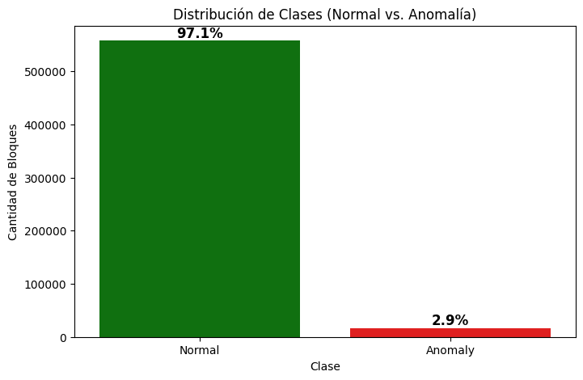
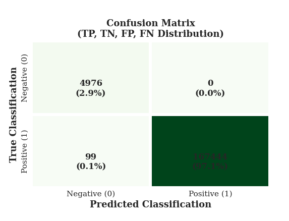
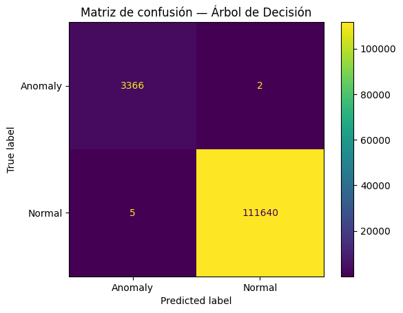
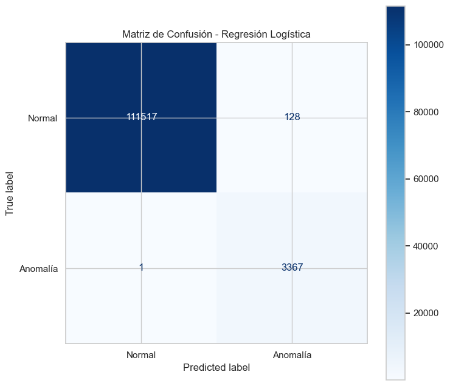
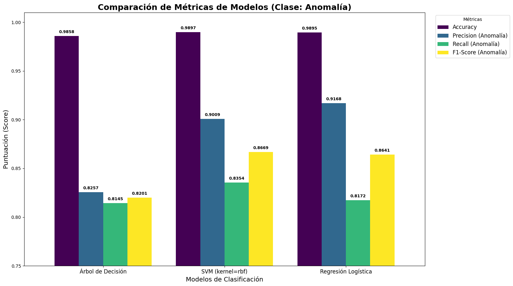

# Taller: Clasificación Supervisada para Detección de Anomalías HDFS

**Objetivo:** Desarrollar, entrenar y comparar clasificadores supervisados (Árbol de Decisión, SVM y Regresión Logística) aplicados a un caso técnico de detección de patrones en datos de logs del sistema HDFS.

**Integrantes:**
* JAVIER ALEJANDRO VEGA MOLINA
* SANTIAGO GERARDO SALAZAR RUIZ
* FABRICIO ARTURO BERMUDEZ ZAMBRANO
* FREDY RICARDO CRUZ SANTANA

---

## 1. Formación de Equipos y Elección del Dataset

* **Repositorio:** Este repositorio contiene todo el código fuente y la documentación del proyecto.
* **Dataset:** Se utiliza el [dataset de logs de HDFS](https://www.kaggle.com/datasets/platform934/hdfs-log-dataset?resource=download), el cual consiste en dos archivos principales:
    1.  `Event_occurrence_matrix.csv`: Una matriz donde cada fila es un "Bloque" (BlockId) y cada columna es un evento (`E1`, `E2`, ...). El valor es la cantidad de veces que ese evento ocurrió en ese bloque.
    2.  `anomaly_label.csv`: Un archivo que etiqueta cada `BlockId` como `Normal` o `Anomalous`.

## 2. Análisis Exploratorio de Datos (EDA)

El primer paso fue analizar los datos. La observación más importante es el **fuerte desbalance de clases** en el dataset. La gran mayoría de los bloques son `Normales` (97.2%) y solo una pequeña fracción (2.8%) son `Anómalos`.

Esto es crítico, ya que significa que un modelo "tonto" que siempre prediga `Normal` tendría una precisión (Accuracy) del 97.2% (la **línea base de precisión**). Por lo tanto, debemos centrarnos en métricas como **Precision, Recall y F1-Score** para la clase `Anomalía`.





## 3. Preprocesamiento de Datos

Esta fue la etapa más crítica del proyecto. El flujo de preprocesamiento validado se encuentra implementado en cada notebook, con ligeras variaciones adaptadas a cada modelo. La lógica central y más robusta (usada en el Árbol de Decisión) es:

1.  **Carga de Datos:** Se cargan `df_occ` (features) y `df_lab` (labels).
2.  **Unión (Merge):** Se unifican los dos DataFrames usando `pd.merge` con `on='BlockId'`. Se utilizan sufijos (`suffixes=('', '_true')`) para manejar la columna `Label` duplicada.
3.  **Selección de 'y':** Se define la variable objetivo `y` usando la columna `Label_true`.
4.  **Mapeo de 'y':** Las etiquetas `Normal` y `Anomalous` se mapean a valores numéricos (`0` y `1`).
5.  **Selección de 'X':** Se definen las características `X` (features) seleccionando solo las columnas de eventos (que comienzan con `E`).
6.  **Limpieza de NaNs:** Se eliminan las filas donde `y` pudiera ser `NaN`.
7.  **División de Datos:** El conjunto se divide en **80% para entrenamiento y 20% para prueba** (`test_size=0.20`) en todos los modelos. Se usa `stratify=y` para asegurar que el desbalance de clases se mantenga en ambas divisiones.
8.  **Escalado de Datos:** Se utiliza `StandardScaler` para los modelos que lo requieren (SVM y Reg. Logística).

## 4. Implementación de Clasificadores

Se implementaron los tres modelos solicitados, cada uno en su propio notebook dedicado para mayor claridad y modularidad:

1.  **Árbol de Decisión (`max_depth=5`):** Ver `modelo-arbol-decision.ipynb`.
2.  **SVM (Análisis de Kernels):** Ver `modelo-svm.ipynb`. Este notebook realiza un análisis exhaustivo comparando múltiples kernels (`linear`, `poly`, `rbf`, `sigmoid`) para encontrar el de mejor rendimiento.
3.  **Regresión Logística:** Ver `modelo-regresion-logistica.ipynb`.

## 5. Comparación Experimental y Resultados

Se recopilaron las métricas obligatorias de cada notebook y se consolidaron en la siguiente tabla para su comparación.

### 5.1. Tabla Resumen de Métricas

Se generó la siguiente tabla de métricas de rendimiento, centrándose en la detección de la clase `Anomalía (1)`. Los resultados del SVM reflejan el rendimiento del kernel `rbf`, que fue el más balanceado.

| Modelo | Accuracy | Precision (Anomalía) | Recall (Anomalía) | F1-Score (Anomalía) |
| :--- | :--- | :--- | :--- | :--- |
| Árbol de Decisión | 0.9858 | 0.8257 | 0.8145 | 0.8201 |
| SVM (kernel=rbf) | 0.9897 | 0.9009 | 0.8354 | 0.8669 |
| Regresión Logística | 0.9895 | 0.9168 | 0.8172 | 0.8641 |

### 5.2. Matrices de Confusión

La siguiente gráfica (ensamblada) compara las matrices de confusión generadas por cada notebook.

*(Ejecutar los notebooks individuales para ver cada matriz)*

#### SVM



#### Árbol de Decisión



#### Regresión Logística



### 5.3. Comparación de Métricas (Gráfico de Barras)

Este gráfico de barras (ensamblado) permite una comparación directa del rendimiento de los modelos en las métricas clave.

*(Ejecutar los notebooks individuales para ver cada set de métricas)*



## 6. Conclusiones Técnicas

* **Rendimiento:** Los tres modelos demostraron un rendimiento muy alto, superando ampliamente la línea base de precisión del 97.2%. Los modelos `SVM` y `Regresión Logística` fueron superiores al Árbol de Decisión.
* **Análisis de SVM:** Tras un análisis detallado en `modelo-svm.ipynb` que comparó los kernels `linear`, `poly`, `rbf` y `sigmoid`, se determinó que el kernel **RBF** (`SVM`) alcanzó el mejor **F1-Score (0.8669)**. Esto indica el mejor balance entre precisión (capturar menos falsos positivos) y recall (capturar más anomalías reales).
* **Interpretabilidad:** Aunque el Árbol de Decisión tuvo un F1-Score ligeramente menor (0.8201), su principal ventaja es la **interpretabilidad**. Podemos analizar sus reglas para entender *por qué* un bloque es clasificado como anómalo.
* **Recomendación:**
    * Para **máximo rendimiento** en la detección, el **SVM (kernel RBF)** es la opción recomendada.
    * Para un sistema que requiera **explicabilidad** y reglas de negocio claras, el **Árbol de Decisión** es la mejor elección.


## 7. Estructura del Repositorio y Ejecución

```
/
│
├── dataset/
│   └── preprocessed/
│       ├── Event_occurrence_matrix.csv
│       └── anomaly_label.csv
│
├── img/
│   ├── distribucion-clases.png
│   ├── mc-arbol-decision.png
│   ├── mc-regresion-logistica.png
│   ├── mc-svm.png
│   └── metricas-comparacion.png
│
├── modelo-arbol-decision.ipynb     <-- (Ejecutar para Modelo 1)
├── modelo-svm.ipynb                <-- (Ejecutar para Modelo 2)
├── modelo-regresion-logistica.ipynb <-- (Ejecutar para Modelo 3)
└── README.md                       <-- (Este archivo)
```

**Para ejecutar:**

1.  Asegúrate de tener las bibliotecas `pandas`, `numpy`, `matplotlib`, `seaborn` y `scikit-learn` instaladas.
2.  Ejecutar cada uno de los tres notebooks (`.ipynb`) de forma individual para replicar los resultados de cada modelo.
3.  Los resultados agregados se resumen en la Tabla 5.1 y en las Conclusiones de este documento.